# Introducción

La necesidad de estudiar y planificar el espacio ha conllevado a la geografía a experimentar un avance articulado a la estadística, los Sistemas de Información Geográfica (SIG) y la estadística aplicada. Por otro lado, el estudio del ciclo hidrológico a nivel de cuenca hidrográfica como elemento fundamental de abastecimiento de agua en los territorios es el caso que nos ocupa en este análisis espacial del área de la cuenca del río Ocoa, cuyo objetivo general es la mera aplicación de un ejercicio académico para el logro del aprendizaje del uso de algoritmos informáticos del software libre R utilizando variables geomorfológicas de esta cuenca del Caribe en la República Dominicana. 

Preguntas de investigación o tema abordado.

¿Qué patrón de asociación puede determinarse a partir de los datos de las variables geomorfológicas disponibles de la cuenca del río Ocoa en la República Dominicana correspondientes al año XXX?

¿Los resultados de las pruebas estadísticas de covariación de las variables seleccionadas, permiten predecir escenarios de comportamiento de la cuenca del río Ocoa a través del diseño de un modelo basado en dichas variables?

# Metodología

Los datos con los cuales se desarrolla el análisis fueron los archivos pre procesados (R. Basin - QGis) de las características geomorfológicas del área de la cuenca del río Ocoa en formato .gpkg y los respectivos archivos poligonales del área de estudio, en el mismo formato.

El criterio de orden de cauces seleccionado fue el de @Quantitativeanalysis, el cual consiste en asignarle un número a cada uno de los cauces tributarios en forma creciente, desde el inicio de la línea divisoria o parte aguas hasta legar al cauce principal, de manera que el número final señale el orden de la red de drenaje en la cuenca.

Este concepto de orden de cauces deriva de @AnalisisMorfometrico quien menciona que HORTON (1945) y @Quantitativeanalysis definen una serie de leyes morfométricas relacionando el número de cauces, sus longitudes, pendientes y áreas de drenaje en una cuenca con el orden de cauces, basándose, por ejemplo, en que la longitud de los cauces afecta claramente a las ratios de recogida de aguas y su transmisión aguas abajo para el caso de la longitud, de igual modo para el resto de las variables.

Por su parte @Quantitativeanalysis afirma que las propiedades adimensionales de la cuenca incluyen números de orden de la corriente, longitud de la corriente y relaciones de bifurcación, ángulos de unión, pendientes máximas del lado del valle, pendientes medias de las superficies de las cuencas hidrográficas, gradientes de canales, relaciones de relieve y propiedades e integrales de curva hipsométrica. 

Tabla 1.  variables seleccionadas para el análisis

|CODIGO|VARIABLES INDEPENDIENTES|CONCEPTO|FORMULA|
|------|----------------------|---------------------------------------|----------|
|MS|Mean_Slope|La pendiente promedio del canal principal (Km) calculada mediante el producto de la longitud de las curvas de nivel (Li) y su equidistancia (E), dividida entre en área de la curva, multiplicada por 100 (%) y expresada en porcentaje.|MS=100*SUMli*E/A|
|TS |Total_Stream_Length_km|La longitud total del canal principal en Km2 (L) corresponde a la longitud más larga de la sucesión de segmentos que conectan una fuente a la salida de la cuenca|TS=L|
| SF| Shape_Factor |El factor de forma relaciona el área de la cuenca (A) y el cuadrado de la longitud del canal principal (L*L).|SF=A/L*L|
|ER   |Elongation_Ratio |La razón de alargamiento relaciona el diámetro del circulo equivalente al perímetro de la cuenca (D) y la longitud del canal principal en Km2 (L).   |ER=D/L |
|DD  |Drainage_Density|La densidad de drenaje (DD) relaciona la longitud total de las ramificaciones del río (l) y el área de la cuenca en Km2|DD=SUM l/A|
|LogDD |VARIABLE INDEPENDIENTE|Transformación logarítmica, dado el sesgo encontrado en las pruebas de dispersión de Moran de la variable DD.|Log (DD|
Fuente: Elaboración propia a partir de @physiograficCharacterization.

Las variables fueron seleccionadas atendiendo a sus coeficientes de correlación obtenidos mediante la función “Cor” de R, dentro de las microcuencas de orden 1, resultando con mayor valor de correlación la variable Densidad de drenaje con Elongation ratio y Shape factor. Sin embargo, se incluyeron dos variables adicionales para robustecer el análisis y modelo resultante. Las dos variables adicionales fueron Total stream lenght y Mean slope.

El procesamiento de los datos puede esquematizarse de la siguiente forma (Script reproducible en archivo adjunto):

I.	Importación, organización de datos e Interoperabilidad.
Los datos de variables geomorfológicas en formato .gpkg y los polígonos en formato .geojson fueron cargados al RStudio conectado al servidor principal (New York). Posteriormente leídos y georeferenciados en el sistema de coordenadas EPSG:32619 WGS 84 / UTM zona 19N, convertidos en un simple feature (“sf”) para ser analizado en R.

Posteriormente, se seleccionó el grupo de microcuencas pertenecientes al Orden de Red de Cuencas 1 (clasificación de Strahler) y organizadas en columnas numéricas con sus respectivas varianzas y depurados de celdas vacías (NA). A partir de la organización de estos primeros datos se procedió a determinar la correlación de variables del estudio a los fines de seleccionar las variables idóneas para el modelo, atendiendo a su índice de correlación.

Una vez obtenidos los índices de correlación, se seleccionaron el grupo de variables con índice de correlación mayor a 0.5 y no tan próximos a 1 (correlación perfecta) que fueran coherentemente relacionables sometiéndolas a las respectivas pruebas de hipótesis en un modelo espacial de cuenca hidrográfica. Es así como se seleccionan la variable Densidad de Drenaje en función de las variables independientes Factor de Forma, Ratio de elongación, longitud total del curso en Km y media de la pendiente; las cuales fueron extraídas de los datos generales mediante un código de selección de la librería deploy el cual permite la Unión Espacial de Variables Seleccionadas para seguidamente diseñar un “sf” de tales variables seleccionadas unidas a los polígonos que permitirán hacer el análisis de agrupación espacial (clusters).

Previo a la evaluación cuantilar de las variables seleccionadas es necesario crear el objeto XY de referencia de cuadrantes para observar la dispersión de las observaciones de las variables analizadas. De tal evaluación cuantilar se determinó el sesgo de la variable dependiente, razón por la cual se hizo la transformación logarítmica de la misma. Hasta aquí se han creado dos objetos correspondientes, primero, al orden inicial de variables seleccionadas y segundo, arreglo de variables con la variable dependiente transformada. Posteriormente, un último objeto con el conjunto de variables completo unido al objeto de referencia cuantilar de normalidad de los datos (XY). Este último objeto, Varselpol3, será utilizado en todos los análisis ESDA subsiguientes para evaluar la relación vecinal y modelo espacial de predicción de la densidad de drenaje en la cuenca del río Ocoa.

II.	Análisis exploratorio de datos espaciales (ESDA):

1.	Autocorrelación espacial en entidades poligonales
Cabe destacar la condición sine qua non del análisis de correlación espacial previo al análisis de vecindad, caso contrario, no se puede interpolar, ni modelar.

En esta fase se aplicaron las pruebas para comprobar tanto el supuesto de normalidad de los datos (Shapiro-Wilk) como el supuesto de autocorrelación de la variable dependiente transformada (I de Moran Global). Esta ultima prueba se hizo tanto gráficamente (moran.plot) como a través de los valores de la probabilidad cuyo valor menor a 0.05 es evidencia preliminar para rechazar la hipótesis nula, la cual niega la existencia de autocorrelación espacial global.

Posteriormente se evalúa la autocorrelación espacial local mediante el diagrama de dispersión de Moran a través de la función `moran.plot`. Finalmente, con el script ‘lisacluster.R’ diseñado previamente se ejecutó la función `lisamap` para generar el mapa LISA. 
En ese caso, el método LISA descompone el índice de Moran y verifica en cuánto contribuye cada unidad espacial a la formación del valor general, permitiendo obtener un valor de significancia para cada cluster formado por los valores similares de cada unidad espacial y sus vecinos. Estos agrupamientos o clusters de especial concentración de valores extremos de una variable se conocen también como zonas calientes/frías (hot spots/cold spots, respectivamente) según se trate de una concentración de valores especialmente altos/bajos de una variable, correspondientemente (Chasco Yrigoyen, 2006:44 citado por @Autocorrelacionespacial).

En ese orden de ideas, @SpatialClustering, describe como métodos para el análisis de la asociación espacial dos categorías: las que se utilizan para determinar si hay agrupación en la región de estudio (agrupamiento global) y las que intentan identificar la ubicación de las agrupaciones (agrupación local). La primera categoría proporciona una estadística única que resume el patrón espacial de la región y el segundo examina subregiones o vecindarios específicos dentro del estudio para determinar si esa área representa un grupo de valores altos (hot spot) o valores bajos (cold spot). 

En consecuencia, el primer paso es definir cuales relaciones entre observaciones deben ser consideradas con peso diferente a cero, es decir, el criterio de vecindad a ser utilizado. Lo segundo es asignar pesos a las conexiones y finalmente, determinar patrones de asociación entre las variables analizadas @AppliedSpatialDataAnalysis.

Para la elaboración del LISA Clúster, nos centraremos en la variable dependiente, “Logaritmo de Densidad de Drenaje (LogDD)”
Las pruebas de vecindad se hicieron por: Contigüidad, los 5 vecinos cercanos, por el peso de las observaciones vecinas en el objeto que contiene las variables seleccionadas y finalmente, en las observaciones de la data completa.

2.	Modelización (Autoregresión espacial – SAR, por sus siglas en inglés).
En este análisis de modelización se exploró el grado de asociación entre la variable Densidad de drenaje (Dependiente) y las variables independientes Factor de Forma (SF), Ratio de elongación (ER), longitud total del curso en Km (TS) y media de la pendiente (MS), representado mediante la función lineal DD= f (SF, ER, TS, MS). 

El modelo fue sometido a las pruebas de supuestos de normalidad (Shapiro-Wilk), Heterocedasticidad (Breush-Pagan) y significancia tanto con la variable original como con la transformada.

3.	Geoestadística – Análisis puntual:
Se inició el proceso con la selección y georreferenciación del sistema de Coordenadas WGS84 UTM Zona 19, EPSG:32619. Seguidamente se creó un objeto para delimitar el área de estudio al orden de red 1 de la clasificación de Strahler y el ajuste logarítmico de la variable dependiente, Densidad de Drenaje, la cual corresponde a una variable de categoría discreta la cual será tomada en este estudio de práctica académica como una variable continua en virtud de que la geoestadística se aplica a variables de carácter continuo, las cuales son interpoladas/inferidas a partir de puntos de muestra.

A partir de la delimitación del área y la transformación logarítmica de la variable dependiente seleccionada, de creó un nuevo objeto (v) a los fines de generar el variograma modelo para proceder a la interpolación. El referido variograma modelo fue evaluado en sus modalidades:

Modelo esférico, modelo Exponencial y modelo Gausiano con rango de 1000 metros respectivamente.


\ldots

# Resultados

```{r, include=FALSE, echo=FALSE}
library(sf)
library(tidyverse)
library(gstat)
library(stars)
library(tmap)
library(ez)
library(RColorBrewer)
library (sp)
library(spdep) 
library(lmtest)
library(spData)
library(knitr)
source('lisaclusters.R')
```

I.	Importación, organización de datos e interoperabilidad

```{r, warning=FALSE, message=FALSE, echo=FALSE}
(datos <- st_read('paramsoutlet_orden1.gpkg', crs = 32619))
(datos <- datos %>% st_difference())
(pol1 <- st_read(dsn = 'r_stream_basins_1.geojson', crs = 32619))
pol2 <- st_read(dsn = 'r_stream_basins_2.geojson', crs = 32619)
pol3 <- st_read(dsn = 'r_stream_basins_3.geojson', crs = 32619)
pol4 <- st_read(dsn = 'r_stream_basins_4.geojson', crs = 32619)
```


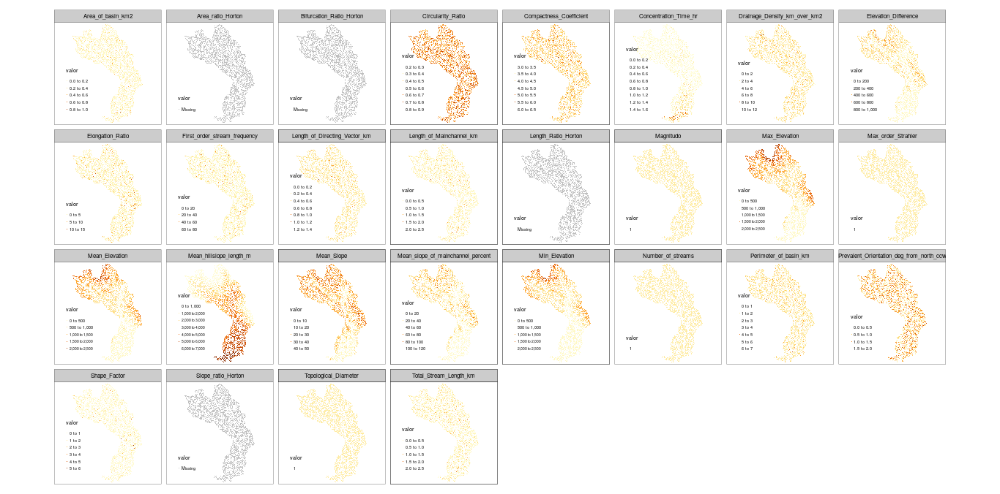

Unión espacial de los datos 

```{r, incluide=FALSE, warning=FALSE, message=FALSE, echo=FALSE}
VARSEL <- datos %>% 
  dplyr::select(
    DD = Drainage_Density_km_over_km2,
    SF = Shape_Factor,
    ER = Elongation_Ratio,
    TS = Total_Stream_Length_km,
    MS = Mean_Slope
  )

Varselpol1 <- pol1 %>% st_join(left = F, VARSEL)
Varselpol2 <- Varselpol1 %>% 
  mutate(logDD = log(DD))

xy <- Varselpol2 %>%
  st_centroid() %>% 
  mutate(x=unlist(map(geometry,1)),
         y=unlist(map(geometry,2))) %>% 
  st_drop_geometry() %>% 
  select(fid, x, y)
Varselpol3 <- Varselpol2 %>% 
  inner_join(xy)
Varselpol3
  
```

Unión espacial de los datos 

```{r, incluide=FALSE, warning=FALSE, message=FALSE, echo=FALSE}

  datosnum <- datos %>%
  st_drop_geometry() %>% 
  select_if(is.numeric) %>% 
  select_if(~ sum(!is.na(.))>0) %>% 
  select_if(function(x) var(x, na.rm=T)!=0)

datosnum %>% ezCor(r_size_lims = 2:3, label_size = 2)
datosnum %>% cor
  
```

El análisis de correlación entre la variable dependiente seleccionada (Densidad de Drenaje) y las demás sometidas a prueba, resultaron con índice mayor a 0.5 factor de forma (-0.669485228) y ratio de elongación (-0.545994239). Para dar mayor robustez al modelo que se diseñó, se incorporaron las variables: pendiente promedio (-0.176066777) y longitud total del curso principal medido en km (0.274832295).

Comprobación del supuesto de distribución normal de las observaciones de las variables analizadas

La comprobación del supuesto de normalidad se hizo mediante el gráfico cuantilar de las variables donde se incluyó el ajuste logarítmico de la variable dependiente a consecuencia del sesgo evidenciado ya que se puede tolerar la no distribución normal de las independientes, no asi en la dependiente.

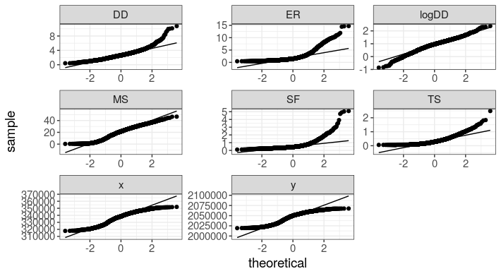

Se asume como válido el supuesto de normalidad de los datos tanto en el diagrama cuantilar normal en el cual se muestra un relativo acercamiento de los puntos a una forma de la recta que representan las observaciones de cada una de las variables analizadas, como los indicadores numéricos de la prueba de Shapiro-Wilk con “p” menores a 0.05, indicando significancia y que se cumple el supuesto de distribución normal de los datos de las variables analizadas.

Comprobación de supuesto de autocorrelación de la variable dependiente transformada (I de Moran Global).


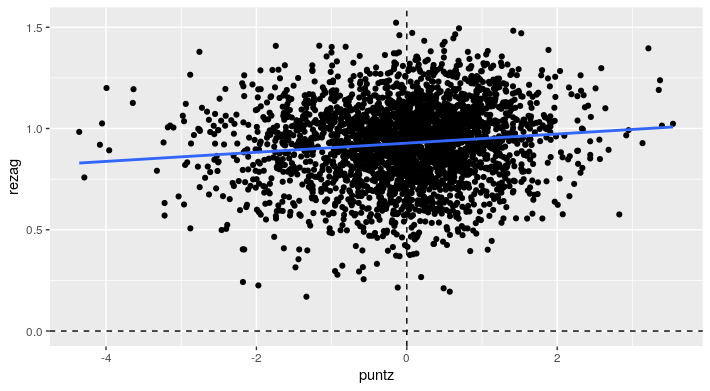

Visualización porcentual de la dispersión de la Variable seleccionada Densidad de Drenage ajustada logarítmicamente en cuatro cuadrantes

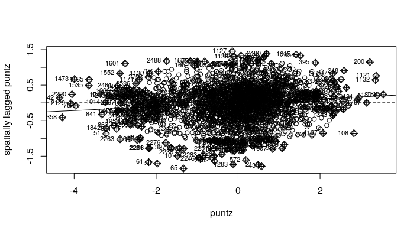

Se rechaza preliminarmente la hipótesis nula la cual sostiene que NO hay autocorrelación espacial dado un valor de “p”< 0.05 (6.07e-05) y se acepta la hipótesis alternativa de que existe autocorrelación espacial global.


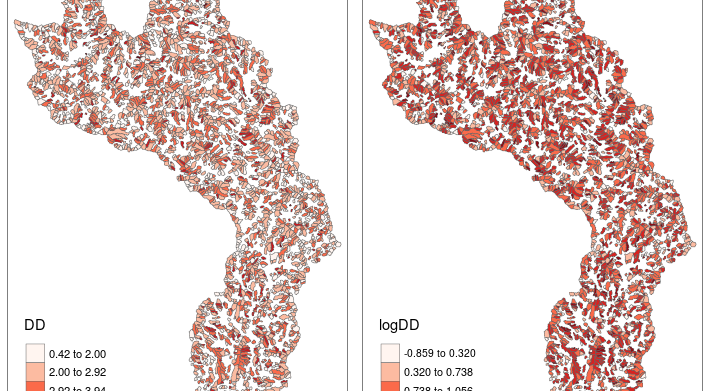

Evaluación de la autocorrelación espacial local de la variable dependiente transformada

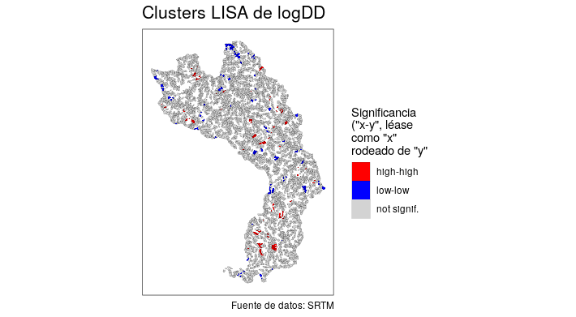

La aparición de parches rojos y azules indican la existencia de autocorrelación local. Los parches rojos traducen hotspots o altos valores de correlación. Los parches azules traducen coldspots e indican autocorrelación con valores bajos. Finalmente, los valores grises indican ausencia de correlación local.

Análisis de vecindad por contigüidad (vecxcont)

Resultaron 3027 regiones ya que cada observación en este caso funge como una unidad espacial independiente. La prueba de peso homogéneo de vecindad arrojó 5760 conexiones distintas de cero con un promedio de conexiones de 1.901618 para un valor porcentual de 6.28%, dos regiones con 9 conexiones y 695 regiones sin conexión alguna.

Análisis de Vecindad por cantidad de los 5 vecinos más cercanos
Los valores de la data completa y la de los 5 vecinos más cercanos ya que cada observación corresponde a una unidad espacial, es decir, absolutamente todas las observaciones son vecinos entre si (In knearneigh(coords, k = 5) : knearneigh: identical points found).

Análisis de Vecindad por peso de observaciones vecinas en Varselpol3
Por tratarse de un espacio geográfico limitado cuyas unidades espaciales (microcuencas) corresponden a las mismas observaciones puntuales, los valores de conexiones y vecindades no difieren mucho en las diferentes combinaciones de vecindad examinadas. En este caso el número de regiones sigue siendo 3027. Las conexiones diferentes de cero son 15145, el porcentaje de conexiones no cero es 16.5% y el promedio de conexiones es de 5.


Modelización

Visualización porcentual de la dispersión de la Variable seleccionada Densidad de Drenaje ajustada logarítmicamente en cuatro cuadrantes

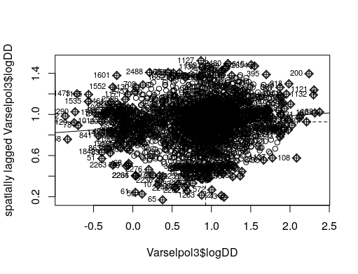

Comprobación del Supuesto de Autocorrelación mediante la Prueba de Moran Global:

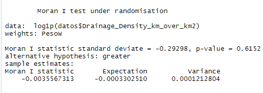

El valor de “p” es mayor a 0.05 (valor comunmente establecido), se acepta la hipotesis nula “No hay autocorrelación espacial global” con sus vecinos en la variable dependiente en su versión original. Aunque el sistema de cuenta de la aceptación de la misma (alternative hyphotesis: greater).

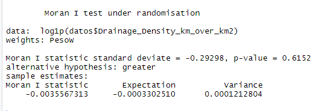

En el caso de la prueba de los supuestos de autocorrelación de la variable tanto por contigüidad como por peso coinciden por la misma causa que en el análisis de vecindad en entidades poligonales, las unidades espaciales (microcuencas) son los mismos puntos de observación, es decir, tenemos tantos modelos como puntos de observación en el análisis.


El valor de “p” es mayor a 0.05 (valor comunmente establecido), se acepta la hipotesis nula “No hay autocorrelación espacial global” con sus vecinos respecto a la variable porcentual ajustada por logaritmo. Aunque el sistema de cuenta de la aceptación de la misma (alternative hyphotesis: greater).


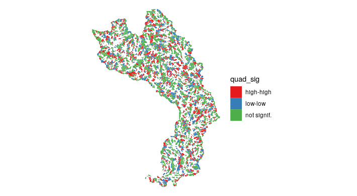


Comprobación del supuesto de normalidad (shapiro-wilk)

data:  Varselpctlog$logDD_PCT
W = 0.33291, p-value < 2.2e-16

El valor de “p” es menor a 0.05 (2.2e-16), se rechaza la hipotesis nula “No hay distribución normal” , en otras palabras se acepta la hipotesis alternativa “Existe distribución normal de las observaciones de la variable analizada(Varselpctlog$logDD_PCT)”.

data:  Varselpctlog$logDD_PCTLOG
W = 0.36622, p-value < 2.2e-16

El valor de “p” es menor a 0.05 (2.2e-16), se rechaza la hipotesis nula “No hay distribución normal” , en otras palabras se acepta la hipotesis alternativa “Existe distribución normal de las observaciones de la variable analizada(Varselpctlog$logDD_PCTLOG)”.
En sisntesis, se cumple el supuesto de normalidad en ambas versiones de la variable dependiente del modelo analizado.

Comprobación de supuesto de heterocedasticidad (prueba de Breusch-Pagan)

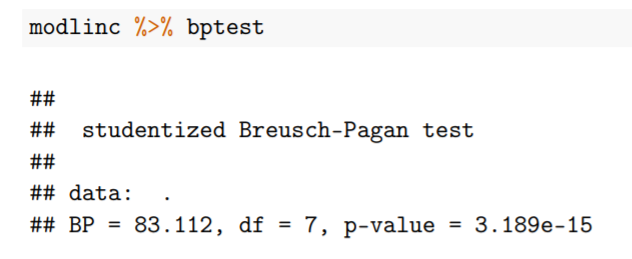

El valor de “p” es menor a 0.05 (3.189e-15), se rechaza la hipotesis nula “No hay homocedasticidad” , en otras palabras se acepta la hipotesis alternativa “Existe heterocedasticidad las observaciones de las variables analizadas en el modelo lineal con la versión de ajuste logaritmico de la variable dependiente.


Análisis del modelo lineal


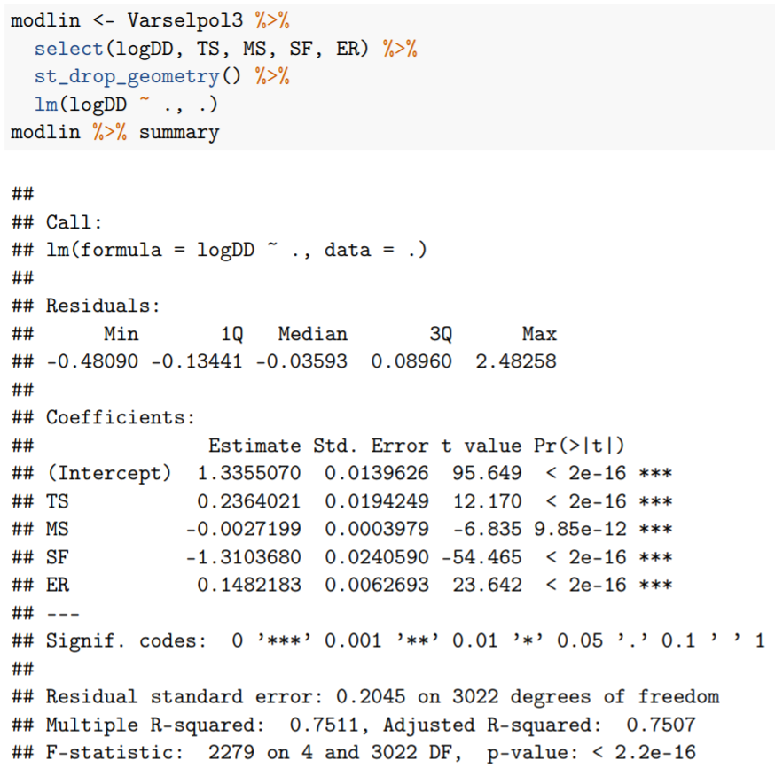

Todos los coeficientes de las variables del modelo han resultado signicativas (p<0.05) y el R cuadrado ajustado del modelo indica que las variables independientes analizadas explican en un 75.07% a la variable dependiente Dendidad de drenaje. Por otro lado, si el valor de las independientes fuera cero, la variable dependiente tomaria el valor 1.3355070 (intercepto).

Las demas pruebas correspondientes al mismo modelo lineal utilizando versiones transformadas de las valiables(% y Log e) resultaron no significativos, es decir, las variables independientes analizadas no logran explicar el comportamiento de la variable dependiente, en tanto, no resultan útiles para la predicción de escenarios de la Densidad de Drenaje de la cuenca del Rio Ocoa.

Análisis del modelo espacial autoregresivo (Variate Simultaneous Autoregresive Model)
No se profundizó este temario en el curso de la asignatura


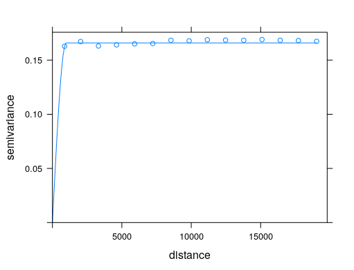

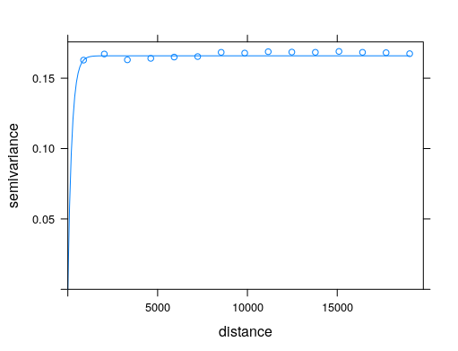

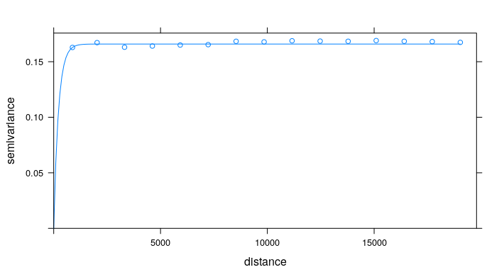


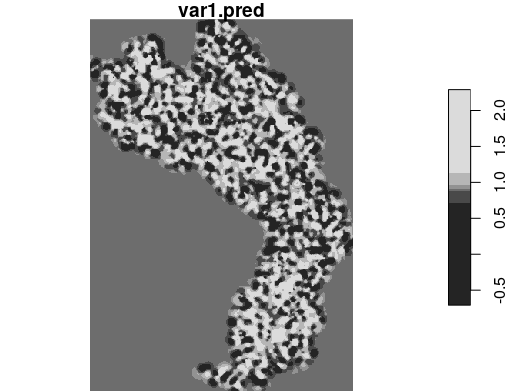


\ldots

# Información de soporte

Material de Apoyo incluido en el repositorio de la maestría Teledeteccion y Ciencias de la Informacion Geografica.
Asesoría con el profesor José Ramón Martínez.


\ldots

# *Script* reproducible

# LIBRERIAS A UTILIZAR 

```{r, Eval=F}
library(sf)
library(tidyverse)
library(gstat)
library(stars)
library(tmap)
library(ez)
library(RColorBrewer)
library (sp)
library(spdep) 
library(lmtest)
library(spData)
source('lisaclusters.R')

```


IMPORTACION, ORGANIZACION DE DATOS E INTERPORABILIDAD

# Cargar datos de variables

```{r, eval=F}
(datos <- st_read('paramsoutlet_orden1.gpkg', crs = 32619))
(datos <- datos %>% st_difference())
(pol1 <- st_read(dsn = 'r_stream_basins_1.geojson', crs = 32619))
pol2 <- st_read(dsn = 'r_stream_basins_2.geojson', crs = 32619)
pol3 <- st_read(dsn = 'r_stream_basins_3.geojson', crs = 32619)
pol4 <- st_read(dsn = 'r_stream_basins_4.geojson', crs = 32619)

```

Orden de Red Cuencas 1, clasificacion de Strahler

```{r, eval=F}
datos %>% dplyr::filter(Max_order_Strahler==1)

datos %>%
  select_if(is.numeric) %>%
  gather(variable, valor, -geom) %>%
  st_drop_geometry() %>% 
  group_by(variable) %>% 
  summarise(m=mean(valor, na.rm=T))

datos %>%
  select_if(is.numeric) %>%
  gather(variable, valor, -geom) %>% 
  tm_shape() + tm_dots(col = 'valor') + tm_facets(by='variable', 
    free.coords = F, free.scales = T)

```

Tabla cols numericas, con varianza 
```{r, eval=F}
datosnum <- datos %>%
  st_drop_geometry() %>% 
  select_if(is.numeric) %>% 
  select_if(~ sum(!is.na(.))>0) %>% 
  select_if(function(x) var(x, na.rm=T)!=0)

```

Evaluacion de correlacion entre las variables como criterio de seleccion
```{r, eval=F}
datosnum %>% ezCor(r_size_lims = 2:3, label_size = 2)
datosnum %>% cor

```

Union espacial de las variables seleccionadas

```{r, eval=F}
VARSEL <- datos %>% 
  dplyr::select(
    DD = Drainage_Density_km_over_km2,
    SF = Shape_Factor,
    ER = Elongation_Ratio,
    TS = Total_Stream_Length_km,
    MS = Mean_Slope
  )

Varselpol1 <- pol1 %>% st_join(left = F, VARSEL)
Varselpol2 <- Varselpol1 %>% 
  mutate(logDD = log(DD))

```


Creación de objeto XY con atributos del objeto Varselpol2 mediante el centroide de los polígonos

```{r, eval=F}
xy <- Varselpol2 %>%
  st_centroid() %>% 
  mutate(x=unlist(map(geometry,1)),
         y=unlist(map(geometry,2))) %>% 
  st_drop_geometry() %>% 
  select(fid, x, y)

```


Creación del objeto Varselpol3 mediante unión de XY y Varselpol2
```{r, eval=F}
Varselpol3 <- Varselpol2 %>% 
  inner_join(xy)
Varselpol3

```


VECINDAD. Analisis de vecindad por contiguidad
```{r, eval=F}
Varselpol3 <- Varselpol2 %>% 
  inner_join(xy)
Varselpol3

```


Análisis de Vecindad por cantidad de los 5 vecinos más cercanos
```{r, eval=F}
Varselpol3.sp <- as_Spatial(Varselpol3)
coords <- coordinates(Varselpol3.sp)
VecxK <- knn2nb(knearneigh(coords, k=5))

```

Análisis de Vecindad por peso de observaciones vecinas en Varselpol3
```{r, eval=F}
PesoW <- nb2listw(VecxK)
PesoW

PesowB <- nb2listw(VecxK, style = 'B')
PesowB

```

Análisis de Vecindad por peso de observaciones vecinas en la data completa
```{r, eval=F}
datos <- datos %>% st_difference()
coords <- coordinates(as_Spatial(datos))
nb <- knn2nb(knearneigh(coords, k = 5))
summary(nb)

```

ANALISIS ESDA
```{r, eval=F}
p1 <- tm_shape(Varselpol3) +
  tm_fill(col = "DD", style = 'jenks', palette = brewer.pal(9, name = 'Reds')) +
  tm_borders(lwd = 0.5)
p1

p2 <- tm_shape(Varselpol3) +
  tm_fill(col = "logDD", style = 'jenks',
          palette = brewer.pal(9, name = 'Reds'), midpoint = NA) +
  tm_borders(lwd = 0.5)
tmap_arrange(p1, p2)

Varselpol3 %>% st_drop_geometry() %>%
  gather(variable, valor, -(fid:label)) %>%
  ggplot() + aes(sample=valor) +
  stat_qq() + stat_qq_line() + theme_bw() +
  theme(text = element_text(size = 14)) +
  facet_wrap(~variable, scales = 'free')

Varselpol3 %>% st_drop_geometry() %>%
  gather(variable, valor, -(fid:label)) %>% group_by(variable) %>%
  summarise(prueba_normalidad=shapiro.test(valor)$p.value)

lisamap(objesp = Varselpol3,
        var ='logDD',
        pesos = PesoW,
        tituloleyenda = 'Significancia\n("x-y", léase\ncomo "x"\nrodeado de "y"',
        leyenda = T,
        anchuratitulo = 1000,
        tamanotitulo = 16,
        fuentedatos = 'SRTM',
        titulomapa = paste0('Clusters LISA de logDD'))

```

MODELIZACION

Variable seleccionada Densidad de Drenaje
```{r, eval=F}
Varselpctlog <- Varselpol3 %>% mutate_each(
  funs(PCT=round(./DD,4)*100,
       PCTLOG=log(round(./DD,4)*100)),
  -1, -2, -geometry, -label)

Varselpctlog

```

Comprobando autocorrelación mediante la prueba moran global

```{r, eval=F}
moran.plot(Varselpol3$logDD, PesoW)
(gmoranw <- moran.test(na.action = na.exclude, zero.policy = T,
            x = log1p(datos$Drainage_Density_km_over_km2), listw = PesoW))

(gmoranb <- moran.test(na.action = na.exclude, zero.policy = T,
            x = log1p(datos$Drainage_Density_km_over_km2), listw = PesowB))

gmoranb <- moran.test(na.action = na.exclude, zero.policy = T, 
           x = Varselpctlog$logDD_PCT, listw = PesowB)
gmoranb

gmoranwl <- moran.test(na.action = na.exclude, zero.policy = T, 
            x = Varselpctlog$logDD_PCTLOG, listw = PesoW )
gmoranwl

gmoranbl <- moran.test(na.action = na.exclude, zero.policy = T, 
            x = Varselpctlog$logDD_PCTLOG, listw = PesowB)
gmoranbl

(gmoranwale<-moran.test(na.action = na.exclude, zero.policy = T, 
             x=rnorm(3027),listw = PesoW))

```

Evaluacion del supuesto de normalidad

```{r, eval=F}
shapiro.test(Varselpctlog$logDD_PCT)
shapiro.test(Varselpctlog$logDD_PCTLOG)

```

Modelo lineal
```{r, eval=F}
modlin <- Varselpol3 %>%
  select(logDD, TS, MS, SF, ER) %>%
  st_drop_geometry() %>%
  lm(logDD ~ ., .)
modlin %>% summary 

modlinc <- Varselpctlog %>%
  select(contains('_PCTLOG')) %>%
  st_drop_geometry() %>%
  lm(logDD_PCTLOG ~ ., .)
modlinc %>% summary

modlinc %>% bptest

sar <- Varselpctlog %>% select(contains('_PCTLOG')) %>%
  st_drop_geometry() %>%
  spautolm(
    formula = logDD_PCTLOG ~ .,
    data = .,
    listw =PesoW)
summary(sar)

sar2 <- Varselpctlog %>% select(contains('_PCTLOG')) %>%
  st_drop_geometry() %>%
  spautolm(
    formula = logDD_PCTLOG ~ TS_PCTLOG + MS_PCTLOG + SF_PCTLOG + ER_PCTLOG,
    data = .,
    listw = PesoW)
summary(sar2)

Sar3 <- Varselpctlog %>% select(contains('_PCTLOG')) %>%
  st_drop_geometry() %>%
  spautolm(
    formula = logDD_PCTLOG ~ TS_PCTLOG + MS_PCTLOG + SF_PCTLOG,
    data = .,
    listw = PesoW)
summary(Sar3)

```

AUTOCORRELACION ESPACIAL LOCAL

```{r, eval=F}
Varselpol_lomo <- localmoran(Varselpctlog$'logDD', listw = PesoW)
summary(Varselpol_lomo)

Varselpctlog$sVarselpctlogDD <- scale (Varselpctlog$'logDD') %>% as.vector()

Varselpctlog$laglogDD <-lag.listw(PesoW, Varselpctlog$'logDD')

summary(Varselpctlog$sVarselpctlogDD)

summary(Varselpctlog$laglogDD)

puntz <- Varselpctlog$sVarselpctlogDD
rezag <- Varselpctlog$laglogDD
df <- data.frame(puntz, rezag)

moran.plot(puntz, PesoW)

```

Diagrama de dispersión de Moran en ggplot
```{r, eval=F}
ggplot(df, aes(puntz, rezag)) +
  geom_point() + geom_smooth(method = 'lm', se = F) +
  geom_hline(yintercept = 0, linetype = 'dashed') +
  geom_vline(xintercept = 0, linetype = 'dashed')

```

Variable nueva sobre significancia de la correlación local, rellena con NAs

```{r, eval=F}
Varselpctlog$quad_sig <- NA

```


Cuadrante high-high quadrant
```{r, eval=F}
Varselpctlog[(Varselpctlog$sVarselpctlog >= 0 &
                Varselpctlog$laglogDD >= 0) &
               (Varselpol_lomo[, 4] <= 0.05), "quad_sig"] <- "high-high"

```


Cuadrante low-low
```{r, eval=F}
Varselpctlog[(Varselpctlog$sVarselpctlog <= 0 &
                Varselpctlog$laglogDD >= 0) & 
               (Varselpol_lomo[, 4] <= 0.05), "quad_sig"] <- "low-low"

```

Cuadrante high-low
```{r, eval=F}
Varselpctlog[(Varselpctlog$sVarselpctlog >= 0 & 
                Varselpctlog$laglogDD <= 0) & 
               (Varselpol_lomo[, 4] <= 0.05), "quad_sig"] <- "high-low"

```


Cuadrante low-high

```{r, eval=F}
Varselpctlog[(Varselpctlog$sVarselpctlog <= 0 & 
                Varselpctlog$laglogDD >= 0) & 
               (Varselpol_lomo[, 4] <= 0.05), "quad_sig"] <- "low-high"

```


No significativas
```{r, eval=F}
Varselpctlog[(Varselpol_lomo[, 4] > 0.05), "quad_sig"] <- "not signif."

```

Convertir a factorial

```{r, eval=F}
Varselpctlog$quad_sig <- as.factor(Varselpctlog$quad_sig)

```

Mapa Significancia
```{r, eval=F}
Varselpctlog %>% 
  ggplot() +
  aes(fill = quad_sig) + 
  geom_sf(color = "white", size = .05)  +
  theme_void() + scale_fill_brewer(palette = "Set1")

```


KRIGING ORDINARIO

Asignacion del sistema de referencia destino
```{r}
crsdestino <- 32619

```

Creacion de objeto para la interpolacion

```{r, eval=F}
orden1logdd <- datos %>% mutate(logDD=log(Drainage_Density_km_over_km2)) %>% select(logDD)

```

VARIOGRAMA MODELO
Creamos el objeto v para representar el variograma v
```{r, eval=F}
v <- variogram(logDD~1, orden1logdd)
plot(v)

```

Variograma modelo Esferico
```{r, eval=F}
v_m <- fit.variogram(v, vgm(model = "Sph", range = 1000))
v_m
plot(v, v_m)

```

Variograma modelo Exponencial
```{r, eval=F}
v_m2 <- fit.variogram(v, vgm(model = "Exp", range = 1000))
v_m2
plot(v, v_m2)

```

Variograma modelo Gauseano
```{r, eval=F}
v_m3 <- fit.variogram(v, vgm(model = "Gau", range = 1000))
v_m3
plot(v, v_m3, plot.numbers = T)
plot(v, v_m3)

```


Atributos de Error
```{r, eval=F}
attr(v_m, 'SSErr')

attr(v_m2, 'SSErr') # Este fue el elegido

attr(v_m3, 'SSErr')

grd <- st_bbox(orden1logdd) %>%
  st_as_stars(dx = 100) %>% #1000 metros=1km de resolución espacial
  st_set_crs(crsdestino)
grd

plot(grd)

```


Mapa Kriging ordinario
```{r, eval=F}
k <- krige(formula = logDD~1, locations = orden1logdd, newdata = grd, model = v_m)

plot(k)

```

Representacion ggplot objeto stars

```{r, eval=F}
ggplot() +
  geom_stars(data = k, aes(fill = var1.pred, x = x, y = y)) + 
  scale_fill_gradient(low="#deebf7", high="#3182bd") +
  geom_sf(data = st_cast(Varselpol3, "MULTILINESTRING")) +
  geom_sf(data = orden1logdd) +
  geom_sf_text(data = Varselpol3, aes(label=''), check_overlap = T, size = 1) +
  theme_bw()

ggplot() +
  geom_stars(data = exp(k), aes(fill = var1.pred, x = x, y = y)) + 
  scale_fill_gradient(low="#deebf7", high="#3182bd", trans = 'log10') +
  geom_sf(data = st_cast(Varselpol3, "MULTILINESTRING")) +
  geom_sf(data = orden1logdd) +
  geom_sf_text(data = Varselpol3, aes(label=''), check_overlap = T, size = 1) +
  theme_bw()

```

\ldots

# Conclusiones

Las conclusiones de este ejercicio académico se limita a los analisis de los resultados de cada una de las pruebas de supuestos aplicadas. No es posible hacer inferencias conclusivas dado el limitado número de variables utilizadas en el análisis en relación con la gran cantidad de variables intervinientes en la dinámica de una cuenca hidrofrafica que deberian tomarse en cuenta para diseñar un modelo de predicción de esta indole.

\ldots

# Referencias
